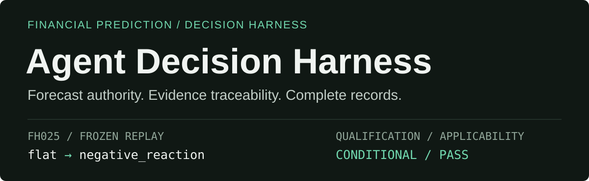
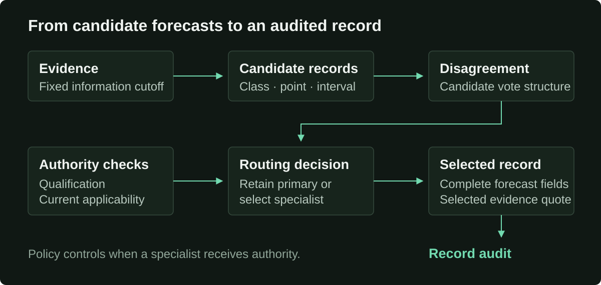

# Agent Decision Harness

<p align="center">
  
</p>

**Inspect which forecaster sets a financial prediction, why authority changes, and which evidence supports the final record.**

[**Interactive demo →**](https://garroshub.github.io/AgentDecisionHarness/page-demo/) · [**Technical report →**](paper/technical_report.pdf) · [Architecture](docs/ARCHITECTURE.md) · [Configuration](docs/CONFIGURATION.md)

Python 3.11+ · Frozen replay without model calls · Codex and Claude Code CLI adapters

## See the decision

The included frozen case contains three candidate forecasts, an auxiliary specialist record, and qualification evidence. Replay exposes the authority decision and checks the complete selected record.

```text
Case               FH025
Qualification      CONDITIONAL
Applicability      PASS
LLM votes          positive_reaction / flat / flat
Auxiliary          negative_reaction
Action             route_and_finalize_complete_record

Final complete record
  class            negative_reaction
  point estimate   -2.35
  interval         [-6.80, +2.10]

Frozen replay check PASS
```

This excerpt comes from `adh replay examples/frozen/FH025_route.json`. The full output includes the selected evidence quote, configuration checks, and six record audits.

## Run the frozen replay

```bash
git clone https://github.com/garroshub/AgentDecisionHarness.git
cd AgentDecisionHarness
pip install -e .
adh replay examples/frozen/FH025_route.json
```

The replay uses stored records. Live mode requires an installed, authenticated provider CLI.

## How authority moves

<p align="center">
  
</p>

| Decision layer | What the harness checks |
| --- | --- |
| Qualification | Specialist status and a matching configuration fingerprint |
| Applicability | Target, horizon, evidence contract, and backbone scope |
| Routing | Candidate vote structure under the configured policy |
| Finalization | The complete selected record, including its evidence quote |
| Audit | Valid class, finite numbers, interval containment, point–class consistency, and quote matching |

The default policy uses three candidate draws and conditional majority-conflict routing. Task and policy overrides support different draw counts, label spaces, numeric bands, and routing rules.

## Read the technical report

**Agent Harnesses for Evidence-Grounded Financial Prediction: Qualification-Gated Authority and Conditional Routing**

Garros Gong

[Read the PDF](paper/technical_report.pdf)

The report evaluates specialist qualification, conditional routing, and forecast-record consistency across financial prediction tasks. This repository provides a configurable implementation and frozen replay examples of the decision design.

## Configure and extend

<details>
<summary><strong>Inspect settings, override rules, or use a live provider</strong></summary>

Inspect the resolved task, policy, and configuration fingerprint:

```bash
adh config examples/live/sample_postearn_codex.json
```

Override the policy or financial target definition:

```bash
adh config examples/live/sample_postearn_codex.json --policy-config examples/config/policy_five_draw.json
adh config examples/live/sample_postearn_codex.json --task-config examples/config/task_wide_return.json
```

Run a configured live case through Codex:

```bash
adh live examples/live/sample_postearn_codex.json --provider codex
```

PowerShell helpers support both provider adapters:

```powershell
.\run_live_demo.ps1 -Provider codex
.\run_live_demo.ps1 -Provider claude
```

New `TaskSpec` definitions retain the forecast contract: discrete label, point estimate, prediction interval, and evidence quote. Qualification fingerprints include the resolved task and policy, provider, backbone, target, horizon, evidence contract, and specialist.

[Configuration guide](docs/CONFIGURATION.md) · [Data contract](docs/DATA_CONTRACT.md)

</details>

## Check the implementation

After installation:

```bash
python -m unittest discover -s tests
```

PowerShell users can also run `.\run_tests.ps1`. The current test suite contains 22 tests.

Candidate providers receive case identity, target, horizon, evidence contract, and point-in-time evidence. Specialist outputs, routing state, oracle data, and realized outcomes stay outside the candidate input. Record consistency checks assess structural properties and exact quote matching.

## Explore the repository

| Location | Contents |
| --- | --- |
| [`src/agent_decision_harness/`](src/agent_decision_harness/) | Providers, qualification, routing, finalization, and audits |
| [`examples/`](examples/) | Frozen records, live-case inputs, and configuration overrides |
| [`tests/`](tests/) | Harness, policy, configuration, and provider tests |
| [`docs/`](docs/) | Architecture, configuration, and data contracts |
| [`page-demo/`](page-demo/) | Static interactive demo; no live model calls |
| [`paper/`](paper/) | Accompanying technical report |

To serve the demo locally, run `python -m http.server 8000 --directory page-demo` and open `http://localhost:8000`.
